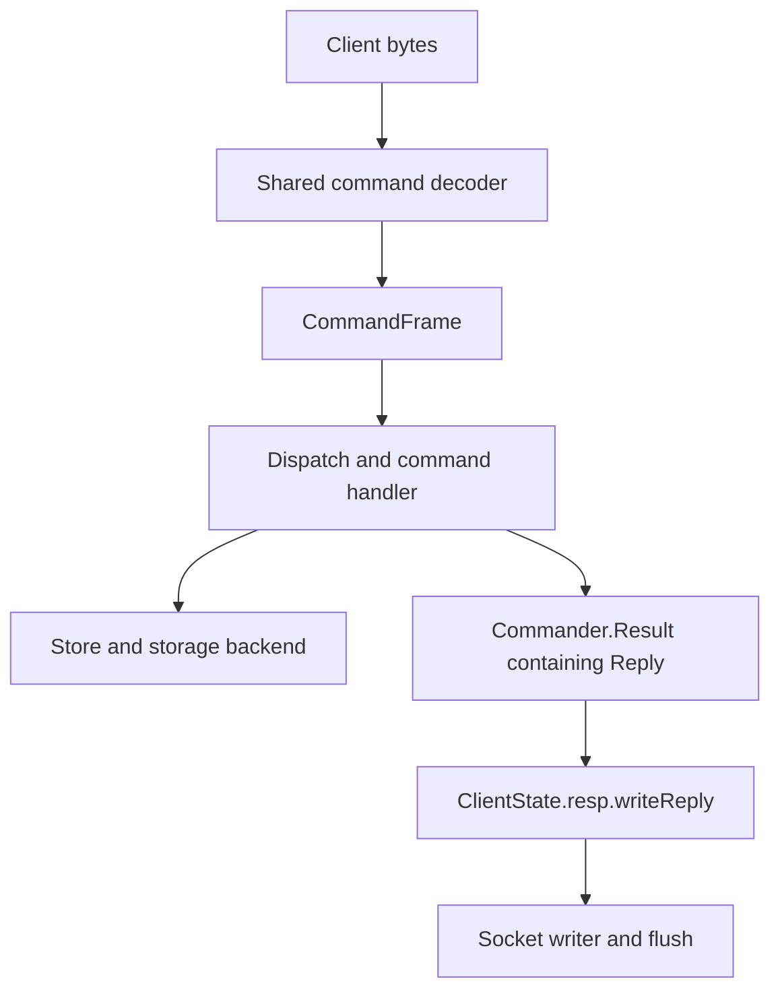
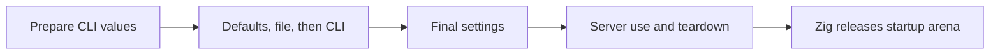

# Architecture

## Role within kgx

kgcache is being developed as the cache component of the kgx infrastructure stack, with standalone operation and Redis compatibility as design goals. The broader platform vision and roadmap are owned by the [kgxlabs organization](https://github.com/kgxlabs).

The intended boundary is that kgcache owns the cache protocol, command semantics, in-memory storage, expiration, and optional persistence. The future kgx platform will coordinate service provisioning, networking, credentials, and deployment lifecycle. That platform integration is a goal, not a capability of the current server.

## Current implementation



Network requests and AOF replay share a decoder for nonempty flat arrays of
non-null bulk strings. It returns a `CommandFrame` containing a name and byte
arguments, alongside an exact consumed-byte count. Arguments exclude the command
name. Their bodies borrow the input buffer; the caller owns their slice table.

Commands return semantic `Reply` values. The connection reads `ClientState.resp`
after execution and uses its selected vtable to encode the reply. Each client
starts in RESP2. Both RESP2 and RESP3 encoders are implemented, but network
negotiation is not available. AOF uses a separate command writer.

The TCP server has three layers for client connections:

1. `Server` owns the listener, accepts client streams, and owns the shared
   server object graph.
2. `ConnectionManager` owns each worker from registration through completion.
   Workers are joinable. Completed workers are reaped in bounded passes during
   normal runtime, and all remaining workers are joined during shutdown.
3. `Connection` serves one client session using borrowed Store, Logger, and
   stream references. The worker closes its stream exactly once when the
   session ends.

The storage backend owns its copied keys and string values, and protects
operations with a mutex-backed transaction boundary.

### Command registry

The command registry is the runtime source of command metadata. Request
dispatch uses its command names and accepted argument counts. `COMMAND`
introspection reads the same definitions for flags, categories, and key
positions.

Command handlers keep value-dependent validation and execution, and construct
semantic replies. The registry contains typed metadata only. Wire encoding
belongs to the selected Resp implementation.

Any Store operation that returns storage-backed data copies it while the
transaction is still locked. The command result owns this copy until reply
encoding and writer flush finish, then `Result.deinit` releases it. This keeps
response bytes valid if another client mutates or removes the stored data.
Result and command cleanup finish before the frame's argument table is freed
or input bytes are reused. Encoding holds no storage lock.

Store mutations that can complete without changing data return
`MutationResult(T)`. Its outcome is `applied` or `not_applied`, while its
`value` holds any data requested from the operation. `SET` uses the value for
the optional previous value, and `DEL` uses `void`. Each command converts this
store result into a `Reply` held by `Commander.Result`.

The application supervises `Server.run` and a SIGINT/SIGTERM waiter with
`std.Io.Select`. The signal handler only records the signal and wakes the
waiter. Normal application code cancels and waits for `Server.run`, which
stops cron and closes the listener before AOF and Store cleanup begins. A
server runtime failure reaches the same cleanup boundary and is reported as
an error, while a requested signal shutdown is a normal exit.

At shutdown, the accept loop and cron stop first. `ConnectionManager` then
sets the stopping flag and shuts client sockets down in both directions to
wake blocked reads and writes. Sessions release their live reply, command,
frame, and input owners before worker completion closes each stream once.
The manager joins every worker. `Server` next waits for and reaps tracked
snapshot and AOF children, then accounts for the save or finishes the rewrite.
Only after that does it close AOF and release Store, Storage, persistence,
and allocator-owned state. The logger owner keeps the logger alive through child completion and
cleanup. A requested shutdown of a client connection is cooperative and does
not produce an error event. The child wait has no deadline; see
[Snapshots](SNAPSHOTS.md#reaping-why-it-cant-happen-inside-bgsave) and
[AOF](AOF.md#shutdown).

### Startup configuration

Every supplied value is validated, including values replaced later. CLI values
are prepared before the optional file is read; they are applied after the file.



CLI and file loading share one arena supplied by Zig. It holds the file
buffer, decoded strings, copied CLI strings, and save rules. Temporary parsing
and builder cleanup keep those retained bytes alive. Server teardown does not
release the arena; Zig releases it after the application returns. A caller that
creates its own arena releases it after the last settings user.

Startup storage stops growing once construction ends. Planned
[live CONFIG updates (#171)](https://github.com/kgxlabs/kgcache/issues/171)
will use temporary request storage and separate, reclaimable runtime copies.
An arena controls lifetime, not memory limits.

## Storage and concurrency trade-offs

The default backend is intentionally straightforward today: a `StringHashMap` stores values, an `ArrayList` holds TTL bookkeeping, and each expiring entry keeps an index into that list for O(1) updates. Full layout, memory cost, and the planned redesign toward larger keyspaces are in [Expiration bookkeeping](EXPIRATION.md).

Concurrency is similarly a deliberate trade-off. The server currently uses a
joinable thread per connection and mutex-protected storage transactions. This
keeps ownership and shutdown explicit, but can move contention to the storage
lock and can create many threads under load. Runtime reaping prevents finished
worker records from accumulating without bound.

The current design is separate from the future [fixed worker event-loop
refactor (#123)](https://github.com/kgxlabs/kgcache/issues/123). That refactor
may replace per-connection threads with a fixed number of workers that each
serve many connections. Until that work begins, the current connection manager
remains the ownership and shutdown boundary.

## Persistence

Snapshots use `SAVE`, `BGSAVE`, or automatic `save` rules. AOF records each
write and can rewrite the growing log in a background child. See
[Persistence](PERSISTENCE.md) for a comparison,
[Snapshots](SNAPSHOTS.md) for snapshot details, and
[Append-only file](AOF.md) for AOF.

See [Errors and logging](ERRORS.md) for error ownership, terminal reports,
and trace availability.

## Repository map

```text
.
├── build.zig
├── kgcache.conf.example         # Config defaults and optional examples
├── src/
│   ├── main.zig                 # Entry point: load config, create/destroy Server
│   ├── server.zig               # Owns the object graph; create/destroy/run
│   ├── connection.zig           # One client session and request loop
│   ├── connection_manager.zig   # Worker ownership, shutdown, joining, reaping
│   ├── cron.zig                 # Background housekeeping loop (tick schedule)
│   ├── expiration.zig           # Active expiration round/batch policy
│   ├── cli.zig                  # Process options and owned prepared config overrides
│   ├── config.zig               # Config struct, defaults, and path helpers
│   ├── config_parser.zig        # kgcache.conf parser
│   ├── config/                  # Definitions, preparation, registry, builder, loader
│   ├── client_state.zig         # Per-client database and selected Resp handle
│   ├── protocol.zig             # Protocol types and module exports
│   ├── protocol/                # Command decoding/writing and RESP2/RESP3 replies
│   ├── resp.zig                 # Legacy parser/serializer outside live paths
│   ├── commander.zig            # Command lookup and dispatch
│   ├── commander/               # Individual commands, schemas, requests
│   ├── codec/                   # Snapshot codecs and canonical AOF encoding
│   ├── store/                   # Store abstraction, memory store, test mock
│   ├── storage/                 # Storage abstraction and default backend
│   ├── persistence/             # Snapshot (.kgc) and AOF backends, SAVE/BGSAVE
│   │   └── drain.zig            # Shutdown child waits and result handling
│   ├── persistence_state.zig    # Persistence lifecycle, retry, and snapshot change accounting
│   ├── entry.zig                # Stored-value and expiration metadata
│   └── tests.zig                # Unit-test entry point
├── docs/                        # Configuration, commands, and architecture reference
│   ├── CONFIGURATION.md
│   ├── COMMAND.md
│   ├── ARCHITECTURE.md          # This file: overview, design direction, repo map
│   ├── PERSISTENCE.md           # Snapshot and AOF overview
│   ├── SNAPSHOTS.md             # SAVE, BGSAVE, and automatic saving
│   ├── AOF.md                   # AOF setup, fsync, loading, and rewrites
│   ├── ERRORS.md                # Error propagation, logging, and traces
│   └── EXPIRATION.md            # TTL bookkeeping layout, memory cost, planned redesign
└── README.md
```
